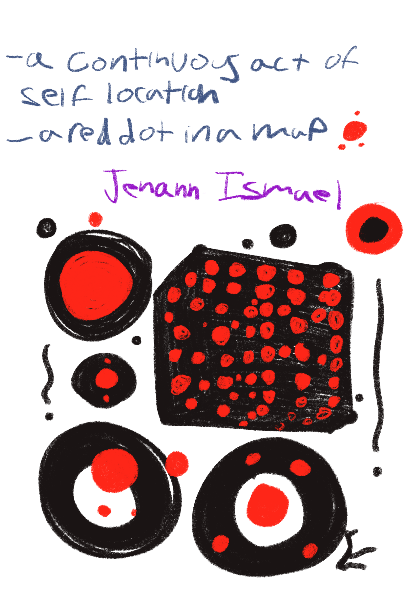
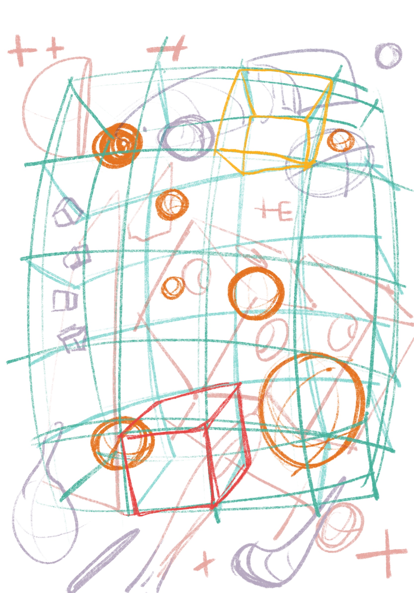

# self-locator
An embodied ML interaction
## Artist statement:
An exploration of gameplay as performance, and of what real-time ML driven behavior can afford to the construction of a visual performance. 

Metaphorically, self locator is meant to abstractly represent the continual act of self location in conscious experience, the way we navigate mental maps and models of reality using ‘mechanisms of semantic descent’ from one representational medium to another. And explore how communication and partnership affect the navigation & creation of mental maps.

## Ideation:

## Technical references:
-  [Advanced Scan Effect PART 1 - Inputs, Blueprints & MPC](https://youtu.be/f5diUsuftEk?si=IqTBDFOUAiPGX3Z9 ) | [Ghislain Girardot](https://www.youtube.com/@ghislaingirardot)

- [Unreal Engine 5.3 - Introduction To HLSL & Scratch Pad In Niagara FX](https://youtu.be/ZNPzpXKvyL4?si=ksjnKMQj2tXugo9B)  | [renderBucket](https://www.youtube.com/@renderbucket)

- [Unreal Engine 5 | Blueprint For Beginners (2023)](https://www.youtube.com/watch?v=Xw9QEMFInYU ) | [SmartPoly](https://www.youtube.com/@SmartPoly)

- [InteractML | Interactive Machine Learning Visual Scripting](https://interactml.com/) 

- [InteractML : Interactive Machine Learning System | UE5 plug in](https://www.unrealengine.com/marketplace/en-US/product/interactml-interactive-machine-learning-system)
## Thematic & artistic references:
- [The Situated Self, J. T. Ismael](https://academic.oup.com/book/2503?login=true)
- Sekamol :
	- https://www.instagram.com/p/Cn7KpsNMrAL/?img_index=1
	- https://www.instagram.com/p/CnuvlvsJCtG/
	- https://www.instagram.com/p/Cmb9b2tpVsZ/
	- https://www.instagram.com/p/CqpkPyJI9sT/
	- https://www.instagram.com/p/CnynC-4gdjn/
	- https://www.instagram.com/p/CnPHVL7ptP9/

---
# InteractML

>*Extended Reality Design Tools : Bringing Machine Learning to Unreal Engine*

InteractML brings machine learning visual scripting to Unreal, empowering creators to develop novel gameplay mechanics, visual experiences, and control schemes without writing code. You can create machine learning models by joining Blueprint nodes together, feeding them from any available parameters, and then using the outputs to drive any in-engine systems or effects you like.

 Unreal | 🟦 Blueprints | 🤖 Machine 🧠 Learning | 🕹️ Interaction | 🎚️ Control | 😎 Visuals | ⏲️ Realtime

# Get Started with InteractML

>Visit the [InteractML Wiki](https://github.com/Interactml/iml-ue4/wiki) to learn all about InteractML 👉
